# 🛍️ Clothing E-commerce

A **clothing online store** project built with **React, Vite, Tailwind CSS, and Firebase**.  
It includes full functionality for both **customers** and **administrators**, with authentication, product management, user management, and order tracking.

---

## 🚀 Technologies Used

- ⚛️ **React** – Main library for building user interfaces.  
- ⚡ **Vite** – Fast and lightweight development environment.  
- 🎨 **Tailwind CSS** – Utility-first CSS framework for responsive and modern designs.  
- 🔥 **Firebase** – Authentication, database, and storage.  

---

## ✨ Main Features

### 👤 Customer
- 🔑 User registration and login.  
- 🛒 Add products to the cart.  
- ❤️ Save products to favorites.  
- 🔍 Search bar in the header (displays "not found" message if no results).  
- ⚡ Filter products by **category**, **price**, or **rating**.  
- 📦 View cart and place orders.  
- 👤 User profile:  
  - Edit personal information.  
  - Upload profile picture.  
  - View pending and delivered orders.  
  - Check order history.  

### 🛠️ Administrator
Restricted access with the following credentials:  
```
Email: admin@gmail.com  
Password: admin@gmail.com  
```

Admin panel includes:  
- 📑 **Order Management**  
  - View orders by customer and status.  
  - Update order status and shipping progress.  
- 👥 **User Management**  
  - Edit user information.  
  - Change user roles (e.g., customer ↔ admin).  
  - Ban or delete users.  
- 👗 **Product Management**  
  - Add new products.  
  - Edit existing products.  
  - Delete products.  

---

## 📂 Installation & Setup

1. Clone the repository:  
   ```bash
   git clone https://github.com/your-username/ecommerce-clothing.git
   cd ecommerce-clothing
   ```

2. Install dependencies:  
   ```bash
   npm install
   ```

3. Configure Firebase credentials in a `.env` file.  

4. Run the project in development mode:  
   ```bash
   npm run dev
   ```

---

## 📸 Screenshots

### 👤 Client Side

#### 🔑 Authentication
- *Login Page*  
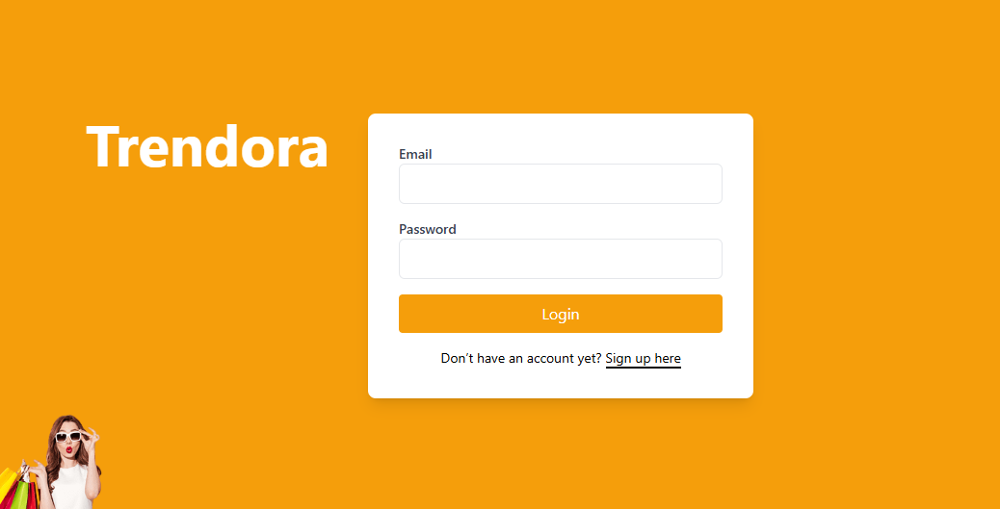

- *Sign Up Page*  


#### 🛒 Shopping
- *Cart*  
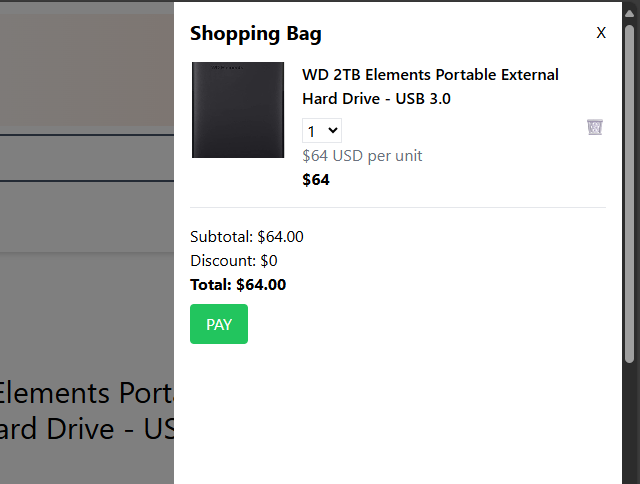

- *Order Details*  
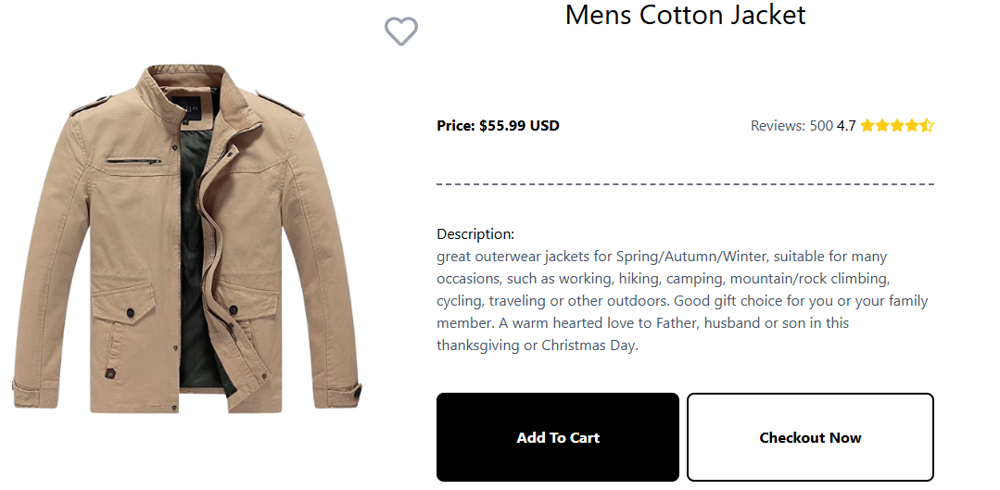

- *Favorites*  
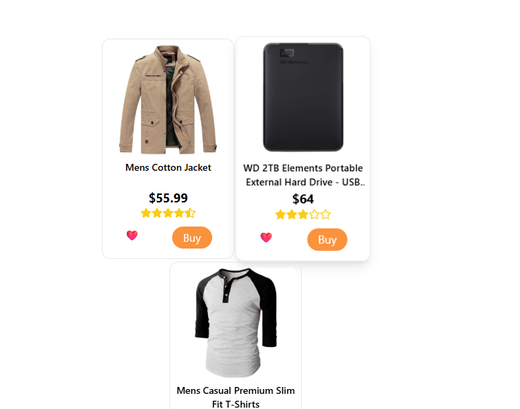

#### 👤 User Profile
- *Profile*  
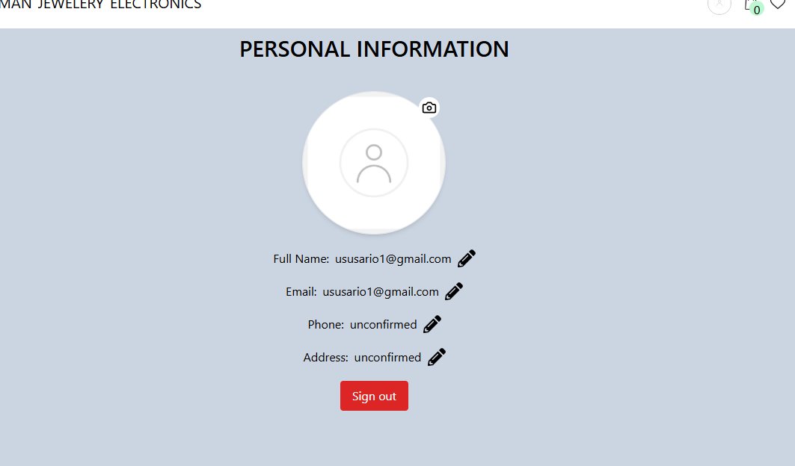

- *Orders History*  
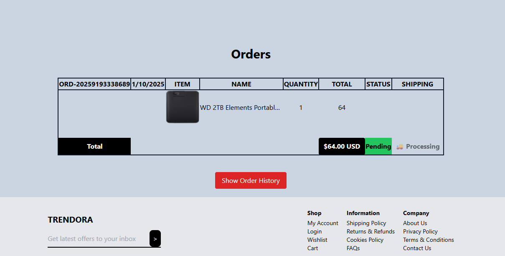


---

### 🛠 Admin Side

#### 📦 Orders Management
- *Orders Panel*  
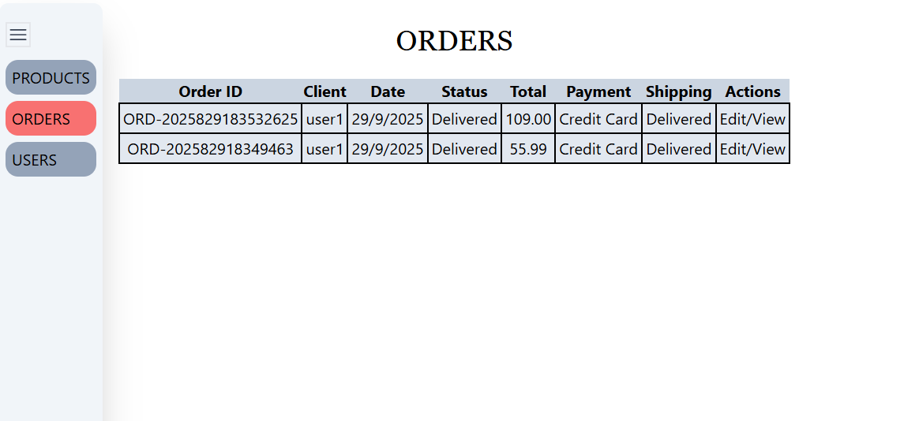

- *Edit Order*  
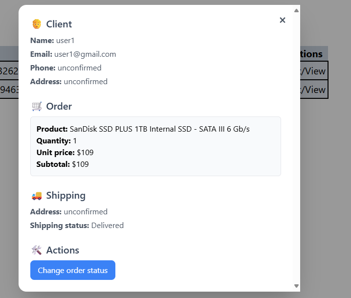

#### 👥 User Management
- *Users Panel*  
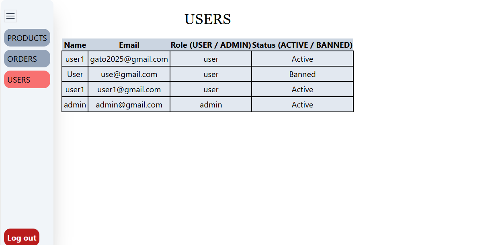

- *Edit User*  
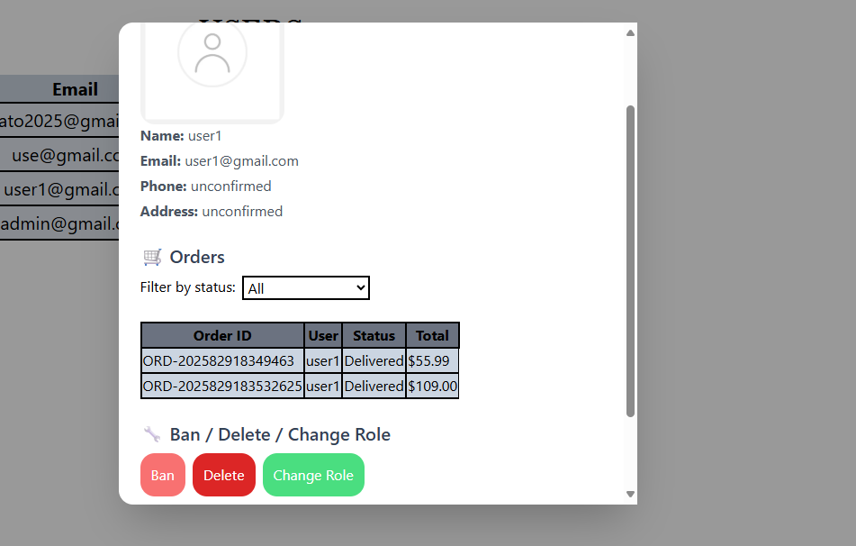

#### 👗 Product Management
- *Products Panel*  
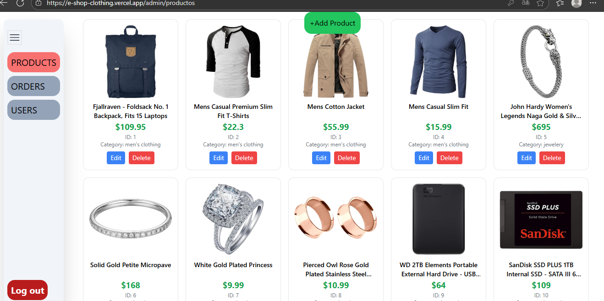

- *Edit Product*  
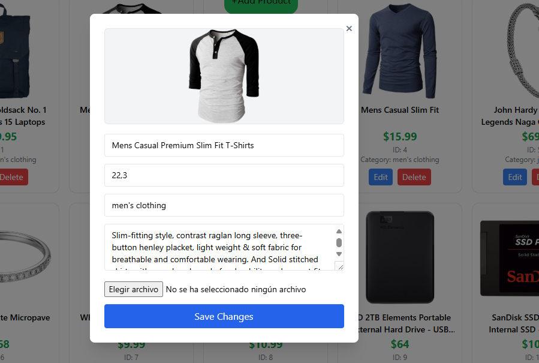


## 📌 Project Status

✅ **Completed and fully functional** – ready for demos and portfolio showcase.  

---

## 📧 Contact

👤 **Yoan Sebastian Ramírez García**  
📍 Pereira, Colombia  
📩 **Email:** yhoangaga2024@gmail.com  
🔗 **GitHub:** [yoan2024](https://github.com/yoan2024)  
💼 **LinkedIn:** https://www.linkedin.com/in/yoanramirezpro/ 

---

## 📝 License

This project is licensed under the **MIT License** – feel free to use and modify it.  
